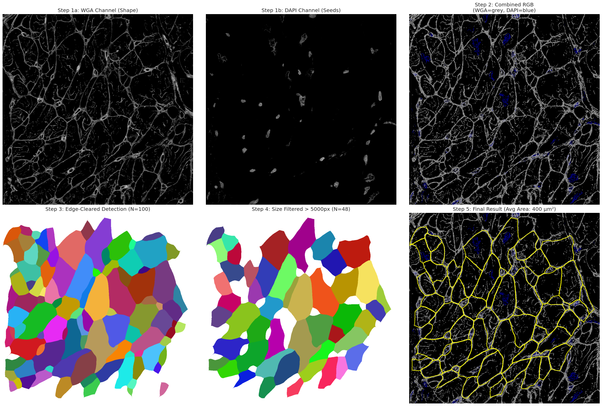
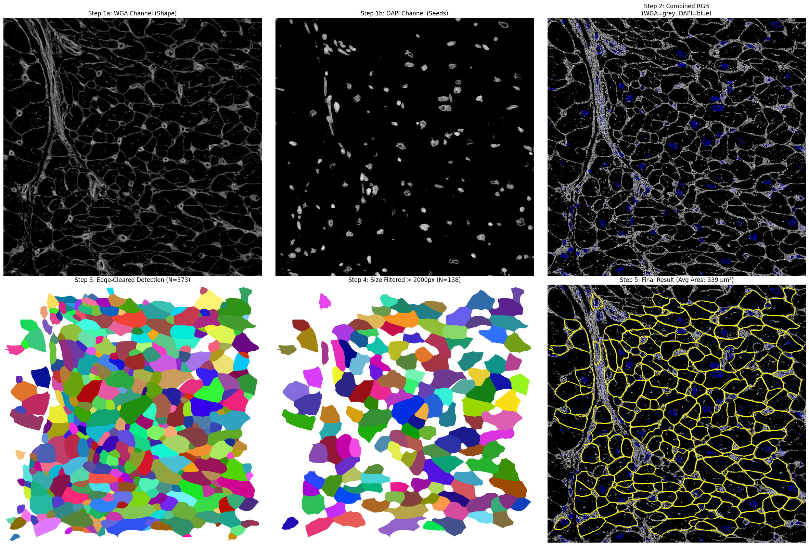
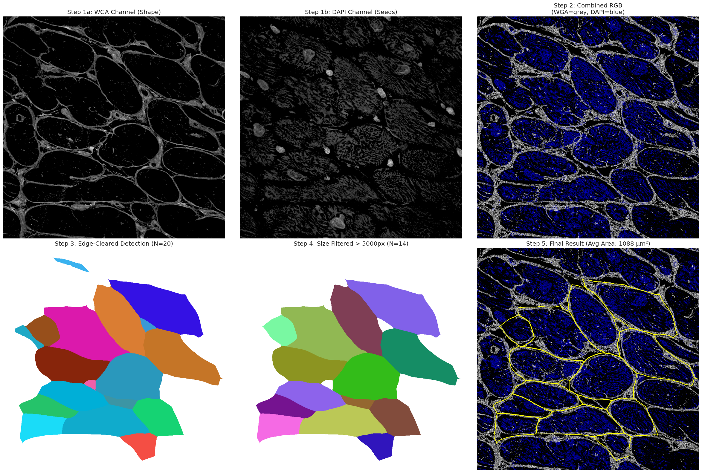

# Cardiomyocyte Segmentation Pipeline

A reproducible pipeline for segmenting cardiomyocytes in immunofluorescence images and quantifying cell size and cell count per image. Segmentation is performed with [Cellpose](https://github.com/MouseLand/cellpose) using the DAPI (nuclei) and WGA (cell borders) channels of Leica confocal `.lif` stacks.

The pipeline is intentionally agnostic to whatever additional IF channel was acquired in the experiment; only DAPI and WGA are read. Any other channels in the `.lif` file are ignored.

The whole pipeline is exposed as importable Python modules under `src/`. The intended way to use it is from a Jupyter notebook (or any Python script), so every parameter is just a Python variable you can change in-line before running the next cell.

------------------------------------------------------------------------

## What it does

Given a folder of `.lif` files captured on a Leica microscope, the pipeline:

1.  Pulls a 2D plane out of each z-stack (max-projection by default).
2.  Pre-cleans the WGA and DAPI channels (Otsu threshold, optional).
3.  Runs **Cellpose** on the (WGA, DAPI) pair to obtain instance masks of cardiomyocytes.
4.  Drops cells touching the image border (truncated cells would bias the size distribution).
5.  Drops objects below a physical-area cutoff in µm² (debris and Cellpose splinters).
6.  Records per-image cell count, edge-removed count, small-removed count, and mean cell area.
7.  Plots distribution histograms, a cell-count-vs-mean-area scatter, and an optional group-comparison boxplot with pairwise t-tests.

### Step-by-step output for one image

Each panel below shows the WGA channel, the DAPI channel, the merged RGB, the raw Cellpose detection after edge clearing, the size-filtered detection, and the final outlines overlaid on the merged image.

  

### Cell count vs. mean area

It will produce a scatter plot for cell counts vs mean cell area per image.

### Group comparison

Once you supply a sample-to-group mapping (see [Group comparison](#5-group-comparison-optional) below), the pipeline produces boxplot + swarm figures with pairwise t-test annotations. Two views are available: one dot per sample (biological-replicate level) and one dot per image (ROI level). Any number of groups is supported.

------------------------------------------------------------------------

## Repository layout

```         
cardiomyocyte-segmentation-pipeline/
├── README.md
├── requirements.txt
├── .gitignore
│
├── src/                            Reusable Python package
│   ├── __init__.py
│   ├── segmentation.py             Single-image pipeline + SegmentationConfig
│   ├── batch.py                    Folder walker that produces the per-image CSV
│   ├── visualization.py            Step-by-step storyboard for one image
│   └── plotting.py                 Histograms, correlation, group comparison
│
├── notebooks/
│   └── pipeline_demo.ipynb         Interactive walkthrough — recommended entry point
│
├── examples/                       Example output figures
│   ├── example_1.png
│   ├── example_2.png
│   ├── example_3.png
│
└── config/
    └── sample_groups.example.csv   Template for the sample-to-group mapping
```

------------------------------------------------------------------------

## Installation

Tested with Python 3.10+.

``` bash
git clone https://github.com/MobinKhoramjoo/cardiomyocyte-segmentation-pipeline
cd cardiomyocyte-segmentation-pipeline

python -m venv .venv
source .venv/bin/activate          # on Windows: .venv\Scripts\activate

pip install -r requirements.txt
```

Cellpose will download its model weights (e.g. `cyto2`) the first time you run the pipeline.

GPU is strongly recommended — Cellpose runs roughly an order of magnitude faster with CUDA. If you don't have a GPU, set `use_gpu=False` in your `SegmentationConfig` and expect longer runtimes.

------------------------------------------------------------------------

## How to use it

The recommended entry point is `notebooks/pipeline_demo.ipynb`, which walks through the whole flow cell by cell. Below is the same flow as plain Python — drop the snippets into any notebook or script.

### 0. Make `src/` importable

If you run from `notebooks/`, add the repo root to `sys.path` once:

``` python
import os, sys
REPO_ROOT = os.path.abspath(os.path.join(os.getcwd(), '..'))
if REPO_ROOT not in sys.path:
    sys.path.insert(0, REPO_ROOT)
```

### 1. Configure the pipeline

Every knob lives on a single `SegmentationConfig` dataclass. Edit fields inline; defaults are tuned for 63x Leica confocal stacks.

``` python
from src.segmentation import SegmentationConfig

cfg = SegmentationConfig(
    dapi_channel=0,         # channel index of DAPI inside the .lif
    wga_channel=2,          # channel index of WGA
    z_strategy='max',       # 'max', 'mid', or an integer z-slice index
    wga_threshold=-1,       # -1 = Otsu, 0 = none, >0 = manual cutoff
    dapi_threshold=-1,
    diameter=200,           # expected cell diameter in pixels
    flow_threshold=0.8,     # higher = accept more irregular shapes
    cellprob_threshold=-2,  # lower  = accept fainter cells
    model_type='cyto2',     # Cellpose model
    use_gpu=True,
    min_area_um2=160,       # debris filter, in physical units
)
```

### 2. Visualise one image first (sanity check)

Confirms the channel indices and Cellpose parameters give sensible masks before you launch a long batch.

``` python
from src.visualization import visualize_pipeline

fig = visualize_pipeline(
    lif_path='/path/to/your_file.lif',
    image_index=0,
    cfg=cfg,
)
fig.savefig('examples/my_step_by_step.png', dpi=200)
```

### 3. Run the batch

Walks the input folder recursively, segments every image inside every `.lif`, and writes one row per image to a CSV. Cellpose is loaded once and reused.

``` python
from src.batch import run_batch

df_results = run_batch(
    input_dir='/path/to/lif_files',
    output_csv='results/per_image_results.csv',
    cfg=cfg,
)
df_results.head()
```

### 4. Distributions, QC, and correlation

``` python
from src.plotting import (
    load_results, add_sample_name,
    plot_distributions, plot_count_vs_area,
)

df_clean = load_results('results/per_image_results.csv', min_cells_per_image=10)
df_clean = add_sample_name(df_clean)

plot_distributions(df_clean)        # cell count + mean area histograms
plot_count_vs_area(df_clean)        # scatter with Pearson r
```

### 5. Group comparison (optional)

For the boxplot, supply a CSV mapping each sample to a group label. See `config/sample_groups.example.csv` for the format:

``` csv
Sample_Name,Group
Sample_01,Group_A
Sample_02,Group_A
Sample_03,Group_B
...
```

`Sample_Name` values must match what `add_sample_name()` extracts from your `.lif` filenames (by default, the first whitespace-separated token of the filename).

``` python
from src.plotting import load_group_mapping, plot_group_comparison

sample_to_group = load_group_mapping('config/sample_groups.example.csv')

GROUP_ORDER  = ['Group_A', 'Group_B', 'Group_C']
GROUP_COLORS = {
    'Group_A': '#488f31',
    'Group_B': '#329db3',
    'Group_C': '#de425b',
}

# One dot per sample (biological replicate)
fig_sample = plot_group_comparison(
    df_clean=df_clean,
    sample_to_group=sample_to_group,
    group_order=GROUP_ORDER,
    group_colors=GROUP_COLORS,
    aggregate_by_sample=True,
)
fig_sample.savefig('examples/group_comparison_sample_level.png', dpi=200)

# One dot per image (ROI-level view, useful for QC)
fig_image = plot_group_comparison(
    df_clean=df_clean,
    sample_to_group=sample_to_group,
    group_order=GROUP_ORDER,
    group_colors=GROUP_COLORS,
    aggregate_by_sample=False,
)
fig_image.savefig('examples/group_comparison_image_level.png', dpi=200)
```

------------------------------------------------------------------------

## Output schema

`per_image_results.csv` has one row per image inside every `.lif`:

| Column | Meaning |
|----|----|
| `File_Name` | Source `.lif` filename. |
| `Image_Name` | Image name as stored in the `.lif` metadata. |
| `Image_Index` | 1-based index of the image inside the file. |
| `Total_Images_In_File` | Number of images in the source `.lif`. |
| `Pixel_Size_um` | Physical pixel size in µm, read from the `.lif` metadata. |
| `Cell_Count` | Cells kept after edge-clearing and size filtering. |
| `Edge_Cells_Removed` | Cells removed because they touched the image border. |
| `Small_Cells_Removed` | Cells removed because they were below `min_area_um2`. |
| `Mean_Area_um2` | Mean area of the kept cells in µm². |

A `Sample_Name` column is added downstream during plotting; by default it's parsed as the first whitespace-separated token of `File_Name`. If your filenames follow a different convention, adjust `add_sample_name()` in `src/plotting.py`.

------------------------------------------------------------------------

## Reproducibility notes

-   Pixel size is read directly from each `.lif` file's metadata, so the µm² area filter and the reported areas are scale-correct even if different acquisitions used different objectives.
-   Cell counts are reported at three stages (initial, after edge clearing, after size filter), so any change in the filters is auditable.
-   Cellpose model weights are versioned by name (`cyto2` here). If you upgrade Cellpose, pin the model name to keep results stable.
-   All Cellpose parameters and the size filter are exposed as fields on `SegmentationConfig` — no hidden defaults.

------------------------------------------------------------------------

## Citing

If you use this pipeline, please cite the Cellpose paper(s):

> Stringer, C., Wang, T., Michaelos, M. & Pachitariu, M. (2021). Cellpose: a generalist algorithm for cellular segmentation. *Nature Methods*, 18, 100–106.
